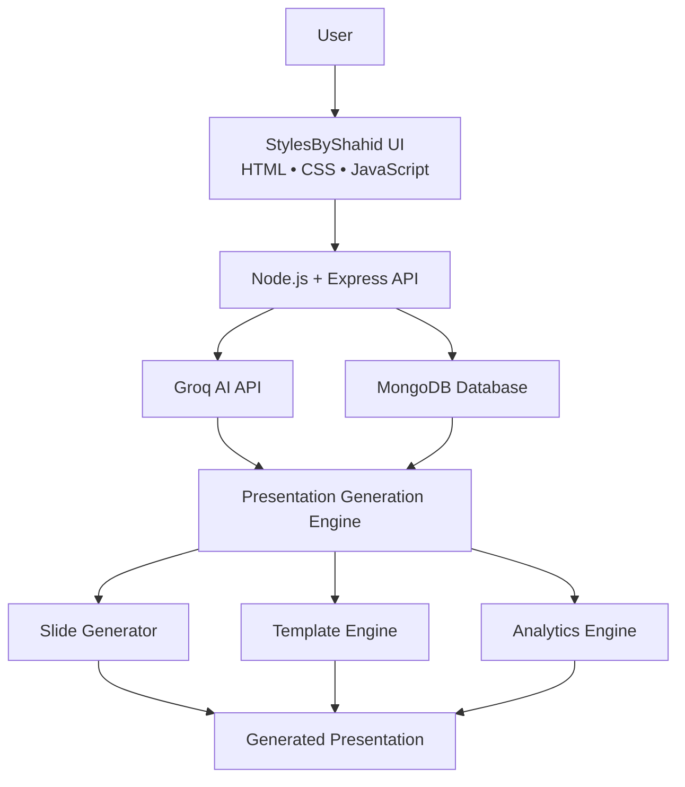

# 🎨 StylesByShahid

> Transform any idea into a professional presentation in seconds using AI.


---

# 🚀 Overview

StylesByShahid is an AI-powered presentation creation platform that transforms a simple topic into a structured, presentation-ready deck.

Built for the **Microsoft Agents League Hackathon 2026 – Creative Apps Challenge**, the platform combines AI-powered content generation, modern presentation design, analytics, and PPTX export into a seamless experience.

Instead of spending hours researching, organizing content, and formatting slides, users can generate professional presentations within seconds.

### 🎥 Demo Media

👉 **[Watch the Full Demo Video on Vimeo](https://vimeo.com/1201001888?share=copy&fl=sv&fe=ci#t=0)**

👉 **[Live Web App](https://shahidmalik786-stylesbyshahid.hf.space/)**

## Screenshot


---

# 🎯 Problem

Creating high-quality presentations requires:

* Researching information
* Organizing content logically
* Structuring slides
* Maintaining design consistency
* Preparing export-ready presentations

For students, educators, creators, and professionals, this process can take hours.

---

# 💡 Solution

StylesByShahid automates presentation creation using AI.

Users simply enter a topic and the platform:

1. Generates presentation content using AI
2. Organizes information into structured slides
3. Applies presentation-ready formatting
4. Provides presentation analytics
5. Exports presentations as PPTX files

This reduces presentation preparation time from hours to minutes.

---

# ✨ Key Features

## 🤖 AI Presentation Generation

Generate complete presentations from a single topic using Groq AI.

### Example

Input:

Future of Artificial Intelligence

Output:

* Title Slide
* Introduction
* Current Landscape
* Applications
* Benefits
* Challenges
* Future Outlook
* Conclusion

---

## ⚡ Groq-Powered AI

Leverages Groq's high-performance inference capabilities for:

* Fast content generation
* Structured presentation creation
* Topic understanding
* Intelligent content organization

---

## 🎨 Modern User Experience

Features a clean and responsive interface with:

* Glassmorphism design
* Dark/Light mode
* Smooth animations
* Mobile responsiveness
* Professional typography

---

## 📊 Analytics Dashboard

Track presentation activity and generated content through an integrated dashboard.

---

## 📂 PPTX Export

Export presentations as PowerPoint-compatible PPTX files for editing and sharing.

---

## 🔒 Secure Architecture

Built using industry-standard security practices:

* JWT Authentication
* Password Hashing
* Input Validation
* CORS Protection
* Secure API Design

---

# 🏗 System Architecture



---

# 🤖 AI Workflow


# 🏆 Agents League Hackathon Submission

## Challenge Track

🎨 Creative Apps

## Why This Project?

Presentation creation is one of the most common productivity tasks worldwide.

StylesByShahid demonstrates how AI can reduce friction between ideas and presentation-ready content by automating content generation, structuring, and export workflows.

---

# 🛠 Technology Stack

## Frontend

* HTML5
* CSS3
* JavaScript

## Backend

* Node.js
* Express.js

## Database

* MongoDB
* Mongoose

## AI

* Groq API

## Authentication

* JWT

## Security

* Helmet
* bcrypt
* Joi Validation
* CORS

---

## Architecture Diagram

Included in this repository.

---

# 📁 Project Structure

```text
stylesbyshahid/
├── backend/
│   ├── models/
│   ├── routes/
│   ├── middleware/
│   ├── server.js
│   └── package.json
│
├── api/
│
├── index.html
├── package.json
├── Dockerfile
├── README.md
└── LICENSE
```

---

# 🚀 Quick Start

## Prerequisites

* Node.js 14+
* MongoDB
* Git

## Installation

```bash
git clone https://github.com/SHAHID-glitch/StylesByShahid.git

cd StylesByShahid

npm install

cd backend

npm install
```

## Environment Variables

```env
PORT=5000
MONGODB_URI=your_mongodb_uri
JWT_SECRET=your_secret
NODE_ENV=development
GROQ_API_KEY=your_groq_api_key
```

## Run Application

```bash
cd backend

npm start
```

Open:

Frontend:
http://localhost:8080

Backend:
http://localhost:5000/api

---

# 🔮 Future Roadmap

Upcoming features:

* AI Website Generation
* Presentation DNA™ Scoring
* Speaker Notes Generation
* AI Presenter Mode
* Judge Mode
* Multi-Agent Workflow
* Microsoft Foundry IQ Integration
* Citation-Based Research Generation

---

# 🤝 Contributing

Contributions are welcome.

1. Fork the repository
2. Create a feature branch
3. Commit your changes
4. Push to GitHub
5. Open a Pull Request

---

# 📝 License

MIT License

---

# 👨‍💻 About the Engineeer

Hi, I'm Shahid Malik — a Full-Stack Developer and BCA student passionate about building AI-powered applications, modern web platforms, and cloud-based solutions.

My work focuses on combining Artificial Intelligence, Web Development, Cloud Technologies, and User Experience Design to create impactful products that solve real-world problems. I enjoy transforming complex ideas into intuitive and accessible applications that people can use effortlessly.

StylesByShahid was created to simplify presentation creation by leveraging AI to generate professional-quality content, structure slides, and streamline the presentation workflow. The goal is to help students, educators, creators, and professionals spend less time designing presentations and more time sharing ideas.

Core Areas of Focus:

* 🤖 Artificial Intelligence & Generative AI
* 🌐 Full-Stack Web Development
* ☁️ Cloud Computing & Azure Technologies
* 📊 Data Science & Analytics
* 🎨 UI/UX Design & User Experience
* 🔧 API Development & Integration
* 📱 Responsive Web Applications
*  🚀 Product Development & Innovation

# 👤 Project About

Author: Shahid Malik

Linkedin Profile: https://www.linkedin.com/in/shahid-malik-765113306

GitHub Prrofile: https://github.com/SHAHID-glitch

Microsoft Learn Profile: SHAHIDMALIK-4825

Project: StylesByShahid

Challenge Track: 🎨 Creative Apps

Event: Microsoft Agents League Hackathon 2026

Built With: JavaScript, Node.js, Express.js, MongoDB, Groq API, HTML, CSS
---

<div align="center">

### Built for Microsoft Agents League 2026

**AI-Powered Presentation Creation Platform**

Made with ❤️ by Shahid Malik

</div>
